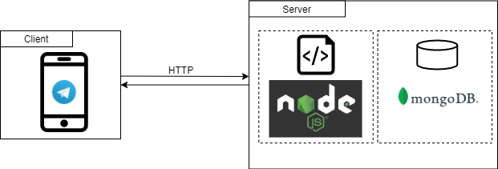

# Experience Sampling Bot for Telegram Messenger

The **Experience Sampling Method (ESM)** is a research methodology to gather information about participants of a study over time. Participants are asked to report their thoughts, feelings, behaviour on multiple occasions during the day over a longer period of time. This method can be applied in **clinical contexts** e.g., for testing a medication and its effects during the day.

ESM based studies often require additional devices and a lot of paper work for participants as well as researchers. There may also be native applications for mobile devices on the market, but as a consequence participants need to install an additional application which they need only temporarily. Therefore, this project uses **Instant Messaging (IM)** and conducts the study via a messaging service. **Telegram** was choosen for this project because of its open Bot API. 

This Chatbot conducts a 5-day signal-contigent experience sampling study via Telegram and provides open or closed questions, the participants need to answer.

## System Overview

This overview shows the high-level interacting components of the bot program:

## Getting Started

Before starting make sure to have fulfilled all the prerequisites:

### Prerequisites

* Latest stable node version installed
* Latest stable mongoDb version installed
* Create your bot on Telegram via the botfather
* Valid authorization token from botfather (How do I create a bot: https://core.telegram.org/bots)
* Preferred IDE: Visual Studio Code

### Getting started on Linux

1. Insert authorization token into the respective variable in bot.js.
2. Start your local instance of a database via `sudo systemd start mongod`.
3. Start the bot program via `node bot.js`.
4. Search the bot on Telegram with the created name.
5. Press **Start** to start the study. As mentioned below the study consists of three parts. So first, the demographic data will be asked, then the main part will start.

### Getting started on Windows

On windows, the same steps as above need to be performed except step 2.) since starting the mongodb instance is a little different. Here, first start the server *mongod* then *mongo* executable.

### Customize questions

The current implementation of this bot conducts a survey regarding the availablility of participants. In order to perform a different kind of ESM study, the questions and answer possibilities can be replaced or adjusted to personal needs.

## Context: Availability Study

This project was part of my bachelor thesis where the use case was to conduct a ESM study for the availability of participants during the day. Availability in this context means the availability to consider taking phone calls or answering text messages during the day. By starting the chatbot, a survey consisting of three parts will be conducted:

### Method

The experiment method consists of three main parts and was conducted completely by the bot itself:

**1. Part 1: Demographical Data**

As in any survey, first the demographical data is collected such as age, gender, job, etc. of the participant. In addition, also the desired time frame of when to receive questions was asked and set, since people may work on night shifts during the study. One limitation is that the time range can only set once in the beginning and cannot be changed during the study.

**2. Part 2: Main Part/ESM cycle**

The main part consists of repeating questions during the day for a period of 5 days. During the day participants will be asked the same questions to different points in  time to get their emotions at that point of time.

The repeating questions include:
  * How available are you at the moment for family/friends?
  * How available are you at the moment for colleagues/fellow students?
  * How available are you at the moment for other contacts?
  * Where are you at the moment?
  * Your current task is mostly related...

**3. Part 3: Satisfaction Survey**

After the study was conducted the particpants got asked about the over satisfaction with the chatbot (or the app, in the control group). 

### Evaluation
The same study set up was done for a control group using a native smartphone application and the experience with both modalieties (app vs. IM) was evaluated.

### Deployment

The application in the context of the thesis evaluation was deployed on a linux server via *screen* tool. Of course, cloud-based options such as Heroku, AWS, etc. may also be applicable. 

## Database model
mongoose
## Session Handling
multi -user support

## License

This project is licensed under the MIT License.

## Acknowledgments

Thanks to mullwar for providing the great telebot api: https://github.com/mullwar/telebot/.
